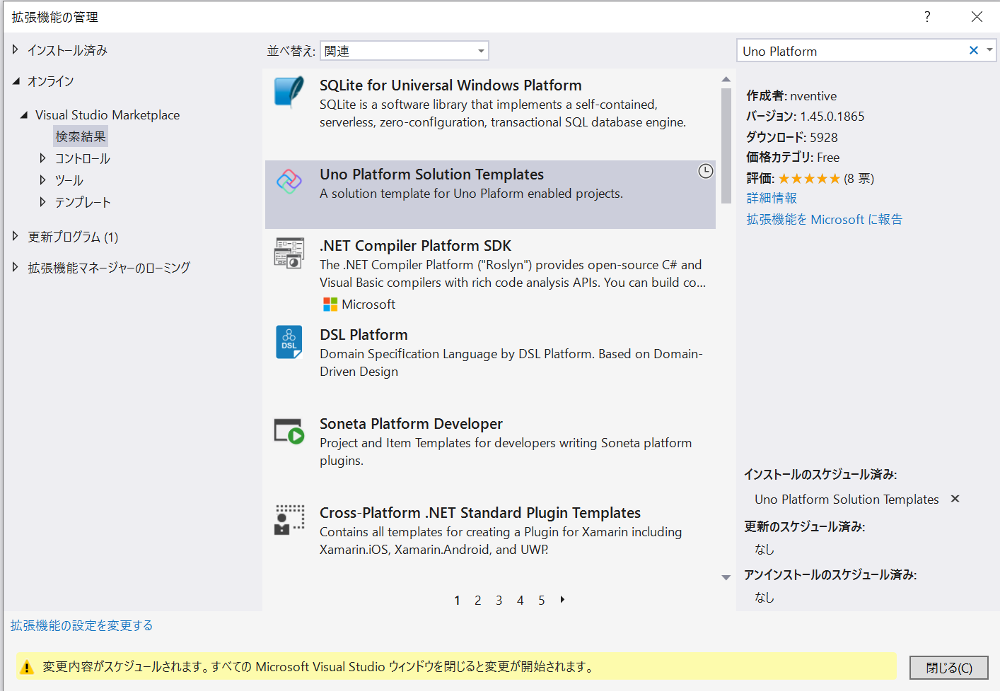

# Demo- Uno Platform

## Uno Platform

* Web / Mobile / Desktop(UWP)をC# ＋ XAMLのシングルコードベースで開発するプラットフォーム
  * Universal Windows Platformは従来通り
  * iOS, AndroidはMono + Xamarin上にUno Platformが用意したUWP互換APIを使用
  * WebはWebAssembly上に動作するMonoにUno PlatformのUWP互換APIを使用
  * [Uno Platform](https://platform.uno/)

## 準備

* 開発はVisual Studio 2019以降 (VS for MacはNG)
  * UWPのワークロードをインストール
  * Xamarinのワークロードをインストール
  * ASP.NETとWeb 開発のワークロードもインストール
  * オプションで.NET Core 2.2のランタイムもインストール
* [Uno Platform Solution Templates](https://marketplace.visualstudio.com/items?itemName=nventivecorp.uno-platform-addin)のインストール
  * [VS Market Place](https://marketplace.visualstudio.com/items?itemName=nventivecorp.uno-platform-addin)もしくはVSの「拡張機能の管理]からインストールする

## 